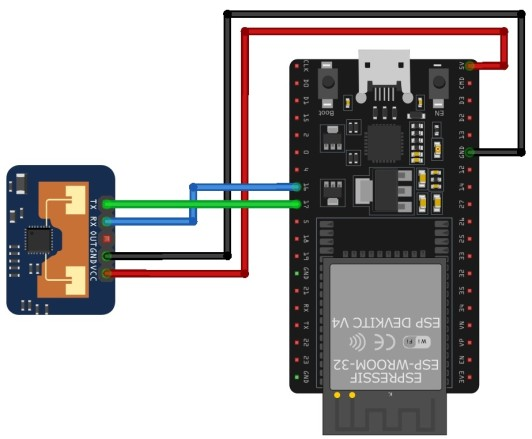

<h1>ESP32 + LD2410C Presence Detection System</h1>

This project implements a <b>room presence detection system</b>b> using an ESP32 microcontroller and the HLK-LD2410C. It detects both <b>moving and stationary</b> people (e.g., someone sitting still), which makes it far more reliable than PIR sensors for smart home and surveillance use cases.

 
<h3>📡Overview</h3>

The system uses:
<ul>
<li><b>ESP32</b> for processing, networking (MQTT / Wi-Fi), and integration</li>
<li><b>LD2410C radar sensor</b> for accurate human presence detection</li>
</ul>

Typical workflow:
<ul>
<li>Sensor continuously scans the environment</li>
<li>ESP32 reads detection data via UART</li>
<li>Presence / distance is processed</li>
<li>Data is published (e.g., MQTT, Home Assistant)</li>
</ul>
 
<h3>🔍 About the Sensor (LD2410C)</h3>

The HLK-LD2410C is a <b>millimeter-wave radar module</b> designed for indoor human detection.🧰 Hardware Requirements
ESP32 development board
LD2410C radar sensor
5V power supply
Jumper wires

<b>Key features</b>
<ul>
<li>Detects <b>motion and stationary presence</b></li>
<li>Adjustable <b>detection range (up to ~6–8 meters)</b></li>
<li>Multi-zone (gate) sensitivity configuration</li>
<li>Real-time distance measurement</li>
<li>Works through:</li>
 <ul>
 <li>glass</li>
 <li>plastic</li>
 <li>thin walls (limited)</li>
 </ul>
</ul>
<b>Advantages over PIR</b>
<ul>
<li>Detects <b>still humans</b> (breathing, micro-movements)</li>
<li>Not affected by temperature</li>
<li>Higher sensitivity and stability</li>
</ul>
 
<h3>🧰 Hardware Requirements</h3>
<ul>
<li>ESP32 development board</li>
<li>LD2410C radar sensor</li>
<li>5V power supply</li>
<li>Jumper wires</li>
</ul>
 
<h3>🔌 Connection Diagram</h3>
<b>Wiring table:</b>
<table>
  <tr>
    <th>LD2410C</th>
    <th>ESP32 Pin</th>
    <th>Description</th>
  </tr>
  <tr>
    <td>VCC (5V)</td>
    <td>5V/VIN</td>
    <td>Power supply</td>
  </tr>
  <tr>
    <td>GND</td>
    <td>GND</td>
    <td>Common ground</td>
  </tr>
 <tr>
    <td>TX</td>
    <td>RX (GPIO 16)</td>
    <td>Sensor - ESP32</td>
  </tr>
 <tr>
    <td>RX</td>
    <td>TX (GPIO 17)</td>
    <td>ESP32 - Sensor</td>
  </tr>
 <tr>
    <td>OUT</td>
    <td>GPIO optional</td>
    <td>Digital presence signal</td>
  </tr>
</table>
 
<b>Diagram:</b>
  

            +----------------------+
          |     LD2410C          |
          |                      |
          |   VCC  ------------+------ 5V (ESP32)
          |   GND  ------------+------ GND
          |   TX   ------------+------ GPIO16 (RX)
          |   RX   <-----------+------ GPIO17 (TX)
          |   OUT  ------------+------ GPIO4 (optional)
          +----------------------+

                        ||
                        ||

          +----------------------+
          |       ESP32          |
          |                      |
          |   VIN / 5V           |
          |   GND                |
          |   GPIO16 (RX)        |
          |   GPIO17 (TX)        |
          |   GPIO4 (INPUT)      |
          +----------------------+
 
<h3>⚙️Communication</h3>
<ul>
<li>Interface: <b>UART</b></li>
<li>Baud rate: <b>256000</b></li>
<li>Data format: binary frames (decoded in firmware)</li>
</ul>
The sensor provides:
<ul>
<li>Moving target distance</li>
<li>Stationary target distance</li>
<li>Energy levels per detection zone</li>
</ul>
 
<h3>🚀Features</h3>
<ul>
<li>Real-time presence detection</li>
<li>Moving vs stationary classification</li>
<li>Distance measurement</li>
<li>MQTT integration (Home Assistant ready)</li>
<li>Optional fast trigger via OUT pin</li>
</ul>
 
<h3>🧠How It Works</h3>
1. LD2410C continuously scans using mmWave radar 
2. Internal DSP processes reflections 
3. Data is sent via UART to ESP32 
4. ESP32:
<ul>
<li>parses frames</li>
<li>extracts distance and presence</li>
<li>publishes results</li>
</ul>
 
<h3>⚠️Important Notes</h3>
<ul>
<li><b>Common ground is required</b> between ESP32 and sensor</li>
<li>Sensor must be powered with <b>5V</b></li>
<li>UART lines must be <b>crossed (TX ↔ RX)</b></li>
<li>Ensure correct baud rate (256000)</li>
<li>Avoid blocking operations in firmware (important for MQTT stability)</li>
</ul>
